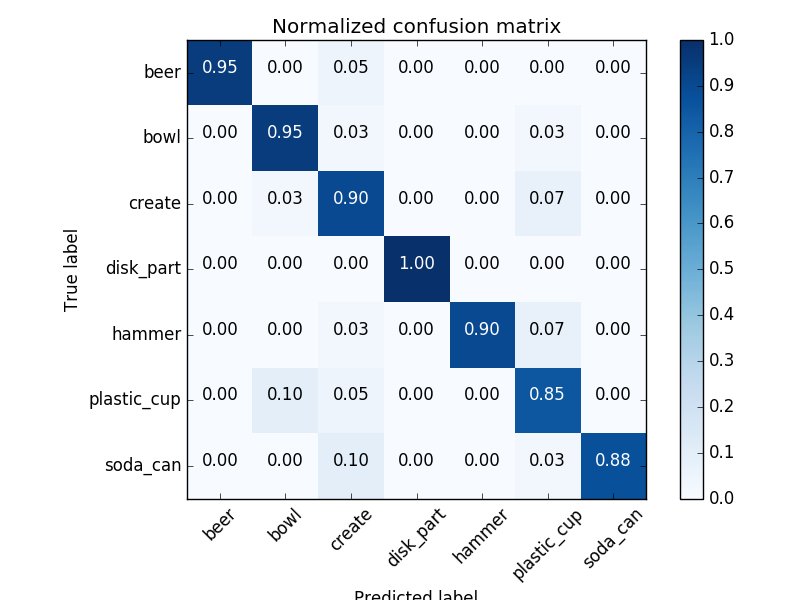

## Project: Perception Pick & Place
### Writeup Template: You can use this file as a template for your writeup if you want to submit it as a markdown file, but feel free to use some other method and submit a pdf if you prefer.

---

# Required Steps for a Passing Submission:
1. Extract features and train an SVM model on new objects (see `pick_list_*.yaml` in `/pr2_robot/config/` for the list of models you'll be trying to identify). 
2. Write a ROS node and subscribe to `/pr2/world/points` topic. This topic contains noisy point cloud data that you must work with.
3. Use filtering and RANSAC plane fitting to isolate the objects of interest from the rest of the scene.
4. Apply Euclidean clustering to create separate clusters for individual items.
5. Perform object recognition on these objects and assign them labels (markers in RViz).
6. Calculate the centroid (average in x, y and z) of the set of points belonging to that each object.
7. Create ROS messages containing the details of each object (name, pick_pose, etc.) and write these messages out to `.yaml` files, one for each of the 3 scenarios (`test1-3.world` in `/pr2_robot/worlds/`).  [See the example `output.yaml` for details on what the output should look like.](https://github.com/udacity/RoboND-Perception-Project/blob/master/pr2_robot/config/output.yaml)  
8. Submit a link to your GitHub repo for the project or the Python code for your perception pipeline and your output `.yaml` files (3 `.yaml` files, one for each test world).  You must have correctly identified 100% of objects from `pick_list_1.yaml` for `test1.world`, 80% of items from `pick_list_2.yaml` for `test2.world` and 75% of items from `pick_list_3.yaml` in `test3.world`.
9. Congratulations!  Your Done!

# Extra Challenges: Complete the Pick & Place
7. To create a collision map, publish a point cloud to the `/pr2/3d_map/points` topic and make sure you change the `point_cloud_topic` to `/pr2/3d_map/points` in `sensors.yaml` in the `/pr2_robot/config/` directory. This topic is read by Moveit!, which uses this point cloud input to generate a collision map, allowing the robot to plan its trajectory.  Keep in mind that later when you go to pick up an object, you must first remove it from this point cloud so it is removed from the collision map!
8. Rotate the robot to generate collision map of table sides. This can be accomplished by publishing joint angle value(in radians) to `/pr2/world_joint_controller/command`
9. Rotate the robot back to its original state.
10. Create a ROS Client for the “pick_place_routine” rosservice.  In the required steps above, you already created the messages you need to use this service. Checkout the [PickPlace.srv](https://github.com/udacity/RoboND-Perception-Project/tree/master/pr2_robot/srv) file to find out what arguments you must pass to this service.
11. If everything was done correctly, when you pass the appropriate messages to the `pick_place_routine` service, the selected arm will perform pick and place operation and display trajectory in the RViz window
12. Place all the objects from your pick list in their respective dropoff box and you have completed the challenge!
13. Looking for a bigger challenge?  Load up the `challenge.world` scenario and see if you can get your perception pipeline working there!

## [Rubric](https://review.udacity.com/#!/rubrics/1067/view) Points
### Here I will consider the rubric points individually and describe how I addressed each point in my implementation.  

---
### Writeup / README

#### 1. Provide a Writeup / README that includes all the rubric points and how you addressed each one.  You can submit your writeup as markdown or pdf.  

You're reading it!

### Exercise 1, 2 and 3 pipeline implemented
#### 1. Complete Exercise 1 steps. Pipeline for filtering and RANSAC plane fitting implemented.
The purpouse of the exercise was to limit the ammount of point cloud data to voxels that are needed for object recognition. Firstly the data is downsampled to a leaf (voxel) size of 1x1x1 cm. Than all the unwanted data below the table is removed with passthrough filter. At the end RANSAC filter is used to find a flat surface (the table). The rest of the data (the outlier) assigned to a variable for further proccesci (clustering).

#### 2. Complete Exercise 2 steps: Pipeline including clustering for segmentation implemented.  
During this exercise, one was suppouse to perform clustering of the cloud remaining from the ex. 1. In order to achive that, euclidean clustering was implemented, which separates pointclouds based on voxel distance. If the distance of voxels were smaller than 5 cm, it was assumed that they belong to the same object. Aditinaly it was assumed that the cluster in not smaller than 100 voxels and not bigger than 10000. To visualize the clustering procces, the voxels belonging to different clusters were colored with different colours and published to /points topic.

#### 3. Complete Exercise 3 Steps.  Features extracted and SVM trained.  Object recognition implemented.
Functions: `compute_color_histograms` and `compute_normal_histograms` were fiiled to capture  fatures. In `object_rocogintion.py` script,code was added to convert ros message to pcl object and concatenate normals and color histograms into one feature vector. Number of beans for color and normal histograms was adjusted to improved performance. 32 bins were used for color (for each HSV component) and 20 bins for normals (for each component: X,Y,Z). For each indentified object 40 orientations were used to build the training set. The results of SVM model validation can be seen in the following image. 

### Pick and Place Setup

#### 1. For all three tabletop setups (`test*.world`), perform object recognition, then read in respective pick list (`pick_list_*.yaml`). Next construct the messages that would comprise a valid `PickPlace` request output them to `.yaml` format.
The functionlity was implemented in `percep.py` script based on `project_template.py`. Most of the code from ex. 1-3 was reused in unchanged form. Statistical outlier filtering was implemented to remove noise. Average of 3 voxel distances was used in the filter. All voxels that had higher 3 voxels distance than mean for all the voxels were removed. The passthrough filter was modified to account for different table hight. Additonal y-axis passthrough filter was use to further reduce the scene. Centers of each detected objects were computed. Based on supplied pick list, arm was assesed for every object as well as place pose. The data was than converted to ros style message in the form required by ros service. The messages were packed into dictionalry variable and writen into yaml files. One `output_*.yaml` file for each world. All the found objects in scenes 1-3 were recognized but algorithm could not find glue in the scene 3 as it was partially covered by another object. Possibly improving clastering algoritm (mayby smller cluster tollerance) would enable better cluster distinction.

